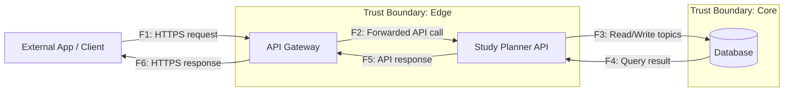

# DFD — Study Planner (Threat Modeling)

DFD-диаграмма сервиса **Study Planner** с границами доверия и нумерованными потоками.

```mermaid
flowchart LR
  Client[External App / Client]

  subgraph Edge["Trust Boundary: Edge"]
    APIGW[API Gateway]
    Service[Study Planner API]
  end

  subgraph Core["Trust Boundary: Core"]
    DB[(Database)]
  end

  Client -- "F1: HTTPS request" --> APIGW
  APIGW -- "F2: Forwarded API call" --> Service
  Service -- "F3: Read/Write topics" --> DB
  DB -- "F4: Query result" --> Service
  Service -- "F5: API response" --> APIGW
  APIGW -- "F6: HTTPS response" --> Client
```
